Predicting Financial behavior
================
PK (Kasidit) Ratanavijai
10/25/2019

# Project objectives

Predicting cycles when FED implemented easing policy (reducing rates) or
tightening policy (increasing rates) and Investor’s behavior towards
long term and short term financial assest by using “DAILY TREASURY YIELD
CURVE RATES” from year January 1981 to June 2014 total of 33 years.

The data set composed of date, rate of US Generic Government teasury 3
months yield, 6 months, 2 years, 3 years, 5 years, 10 years and 30
years, and whether FED was using easing policy (reducing rates) or
tightening policy (increasing rates) at the time.

It is public data set and can be found on *treasury.gov*
(<https://home.treasury.gov/policy-issues/financing-the-government/interest-rate-statistics>)

# Data exploration

**Data
    Summary**

    ##      USGG3M           USGG6M           USGG2YR           USGG3YR       
    ##  Min.   :-0.041   Min.   : 0.0051   Min.   : 0.1532   Min.   : 0.2764  
    ##  1st Qu.: 1.705   1st Qu.: 1.8060   1st Qu.: 2.7265   1st Qu.: 3.1298  
    ##  Median : 4.994   Median : 5.1049   Median : 5.4000   Median : 5.5215  
    ##  Mean   : 4.675   Mean   : 4.8444   Mean   : 5.4389   Mean   : 5.6445  
    ##  3rd Qu.: 6.275   3rd Qu.: 6.5160   3rd Qu.: 7.5495   3rd Qu.: 7.6939  
    ##  Max.   :17.010   Max.   :15.9300   Max.   :16.9590   Max.   :16.5900  
    ##                                                                        
    ##     USGG5YR           USGG10YR         USGG30YR         Output1        
    ##  Min.   : 0.5426   Min.   : 1.387   Min.   : 2.453   Min.   :-13.1731  
    ##  1st Qu.: 3.6628   1st Qu.: 4.262   1st Qu.: 4.822   1st Qu.: -6.5091  
    ##  Median : 5.7350   Median : 5.955   Median : 6.221   Median : -0.4149  
    ##  Mean   : 6.0094   Mean   : 6.481   Mean   : 6.869   Mean   :  0.0000  
    ##  3rd Qu.: 7.8975   3rd Qu.: 8.185   3rd Qu.: 8.310   3rd Qu.:  4.8599  
    ##  Max.   :16.2740   Max.   :15.842   Max.   :15.212   Max.   : 27.2979  
    ##                                                                        
    ##      Easing       Tightening  
    ##  Min.   :1      Min.   :1     
    ##  1st Qu.:1      1st Qu.:1     
    ##  Median :1      Median :1     
    ##  Mean   :1      Mean   :1     
    ##  3rd Qu.:1      3rd Qu.:1     
    ##  Max.   :1      Max.   :1     
    ##  NA's   :6715   NA's   :7527

**Structure of the data set**

  - **USGG3M** `<numeric>` rate of US Generic Government teasury 3
    months yield
  - **USGG6M** `<numeric>` rate of US Generic Government teasury 6
    months yield
  - **USGG2YR** `<numeric>` rate of US Generic Government teasury 2
    years yield
  - **USGG5YR** `<numeric>` rate of US Generic Government teasury 3
    years yield
  - **USGG10YR** `<numeric>` rate of US Generic Government teasury 5
    years yield
  - **USGG30YR** `<numeric>` rate of US Generic Government teasury 10
    years yield
  - **Output1** `<numeric>` sssssxxxx
  - **Easing** `<int>` whether FED was using easing policy (reducing
    rates)
  - **Tightening** `<int>` whether FED was using tightening policy at
    the time (increasing rates)

First 7 variables (input variables) are daily records of the US Treasury
yields to maturity. The last two variables mark periods when FED
implemented easing policy (reducing rates) or tightening policy
(increasing rates).

**Header of the training data
    set**

    ##           USGG3M USGG6M USGG2YR USGG3YR USGG5YR USGG10YR USGG30YR  Output1
    ## 1/5/1981   13.52  13.09  12.289   12.28  12.294   12.152   11.672 18.01553
    ## 1/6/1981   13.58  13.16  12.429   12.31  12.214   12.112   11.672 18.09140
    ## 1/7/1981   14.50  13.90  12.929   12.78  12.614   12.382   11.892 19.44731
    ## 1/8/1981   14.76  14.00  13.099   12.95  12.684   12.352   11.912 19.74851
    ## 1/9/1981   15.20  14.30  13.539   13.28  12.884   12.572   12.132 20.57204
    ## 1/12/1981  15.22  14.23  13.179   12.94  12.714   12.452   12.082 20.14218
    ##           Easing Tightening
    ## 1/5/1981      NA         NA
    ## 1/6/1981      NA         NA
    ## 1/7/1981      NA         NA
    ## 1/8/1981      NA         NA
    ## 1/9/1981      NA         NA
    ## 1/12/1981     NA         NA

**History of Interest Rates**

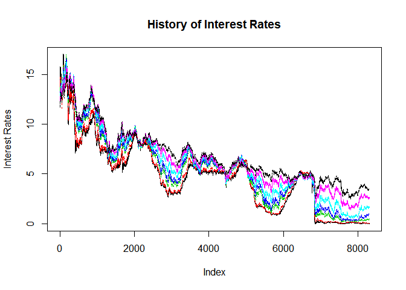<!-- -->

**History of Interest Rates and Output**

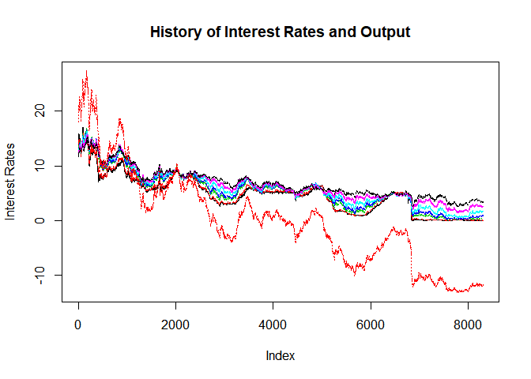<!-- -->

# Data preparation

**from Data exploration we can see that there are NAs in Easing and
Tightening** Make column “Tightening” equal to 1 during tightening
periods and 0 otherwise.

# Modelling

## Linear regression model

**Fit 7 regression models, in each of them input variable of interest
rate is response and Output1 is the single predictor**

``` r
#Fit 7 simple regression models
mUSGG3M = lm(AssignmentData$USGG3M ~ Output1)
mUSGG6M = lm(AssignmentData$USGG6M ~ Output1)
mUSGG2YR = lm(AssignmentData$USGG2YR ~ Output1)
mUSGG3YR = lm(AssignmentData$USGG3YR ~ Output1)
mUSGG5YR = lm(AssignmentData$USGG5YR ~ Output1)
mUSGG10YR = lm(AssignmentData$USGG10YR ~ Output1)
mUSGG30YR = lm(AssignmentData$USGG30YR ~ Output1)
```

Here is significance of the estimated parameters and the model
**mUSGG3M** as a whole, proportion of explained correlation.

    ##       Total.Variance Unexplained.Variance 
    ##           76.8044379            0.4374763

and coefficient

    ## (Intercept)     Output1 
    ##   4.6751341   0.3839609

Plot the output variable together with the fitted values.

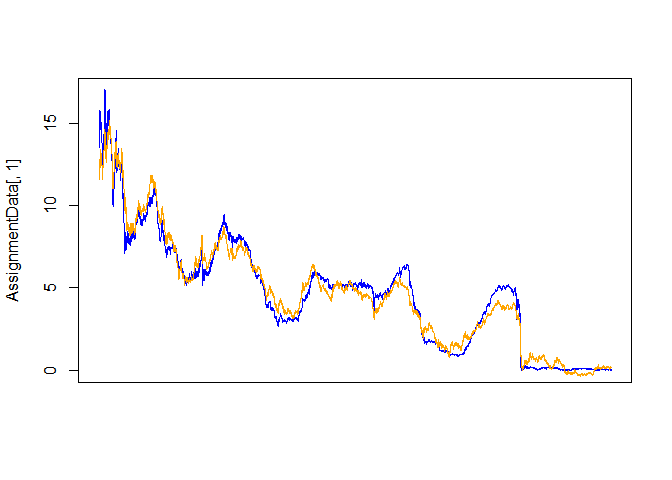<!-- -->

Collect all slopes and intercepts in one matrix called
simpleRegressionResults and keep this matrix

    ##          regrIntercepts    Slopes
    ## USGG3M         4.675134 0.3839609
    ## USGG6M         4.844370 0.3901870
    ## USGG2YR        5.438888 0.4151851
    ## USGG3Y         5.644458 0.4063541
    ## USGG3Y.1       5.644458 0.4063541
    ## USGG5Y         6.009421 0.3860610
    ## USGG10Y        6.481316 0.3477544
    ## USGG30Y        6.869355 0.3047124

Use fitted models for newPredictor with file
‘Output\_for\_prediction.csv’

``` r
#Use function predict() to predict 7 interest rates for the value of newPredictor
prUSGG3M=predict(mUSGG3M,newdata=newPredictor)
prUSGG6M=predict(mUSGG6M,newdata=newPredictor)
prUSGG2YR=predict(mUSGG2YR,newdata=newPredictor)
prUSGG3YR=predict(mUSGG3YR,newdata=newPredictor)
prUSGG5YR=predict(mUSGG5YR,newdata=newPredictor)
prUSGG10YR=predict(mUSGG10YR,newdata=newPredictor)
prUSGG30YR=predict(mUSGG30YR,newdata=newPredictor)
```

**examine
    predicted.values**

    ##          1          1          1          1          1          1 
    ## 0.08403873 0.17882799 0.47443916 0.78560235 1.39321456 2.32314886 
    ##          1 
    ## 3.22584959

## Logistic regression model

**Plot the data and the binary output variable representing easing (0)
and tightening (1) periods.**

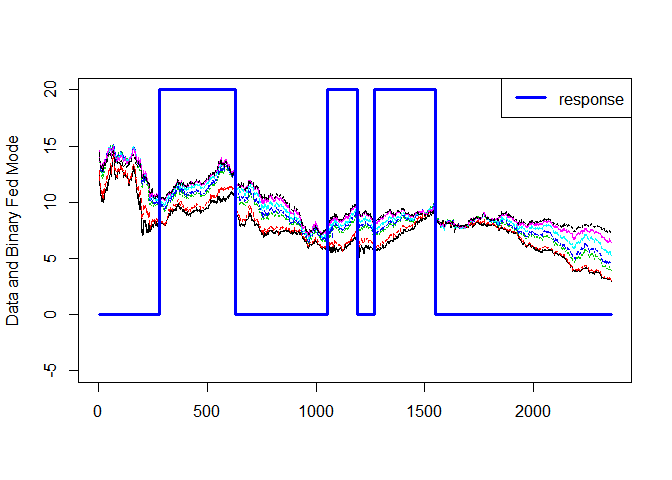<!-- -->

Estimate logistic regression with 3M yields as predictor and Tightening
as
output.

``` r
LogisticModel_3M<-glm(Tightening~USGG3M,family=binomial(link=logit),AssignmentDataLogistic)
summary(LogisticModel_3M)
```

    ## 
    ## Call:
    ## glm(formula = Tightening ~ USGG3M, family = binomial(link = logit), 
    ##     data = AssignmentDataLogistic)
    ## 
    ## Deviance Residuals: 
    ##     Min       1Q   Median       3Q      Max  
    ## -1.4239  -0.9014  -0.7737   1.3548   1.6743  
    ## 
    ## Coefficients:
    ##             Estimate Std. Error z value Pr(>|z|)    
    ## (Intercept) -2.15256    0.17328 -12.422   <2e-16 ***
    ## USGG3M       0.18638    0.02144   8.694   <2e-16 ***
    ## ---
    ## Signif. codes:  0 '***' 0.001 '**' 0.01 '*' 0.05 '.' 0.1 ' ' 1
    ## 
    ## (Dispersion parameter for binomial family taken to be 1)
    ## 
    ##     Null deviance: 2983.5  on 2357  degrees of freedom
    ## Residual deviance: 2904.8  on 2356  degrees of freedom
    ## AIC: 2908.8
    ## 
    ## Number of Fisher Scoring iterations: 4

Plot the data, the response and the predicted probability of tightening.

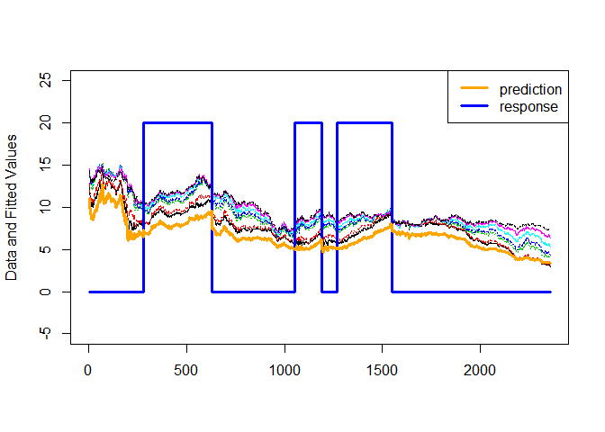<!-- -->

Now use all inputs as predictors for logistic regression. Name the model
LogisticModel\_All.

``` r
LogisticModel_All = glm(Tightening~USGG3M+USGG6M+USGG2YR+USGG3YR +USGG5YR +USGG10YR +USGG30YR  ,family=binomial(link=logit),AssignmentDataLogistic)
summary(LogisticModel_All)
```

    ## 
    ## Call:
    ## glm(formula = Tightening ~ USGG3M + USGG6M + USGG2YR + USGG3YR + 
    ##     USGG5YR + USGG10YR + USGG30YR, family = binomial(link = logit), 
    ##     data = AssignmentDataLogistic)
    ## 
    ## Deviance Residuals: 
    ##     Min       1Q   Median       3Q      Max  
    ## -2.2113  -0.8595  -0.5935   1.1306   2.5530  
    ## 
    ## Coefficients:
    ##             Estimate Std. Error z value Pr(>|z|)    
    ## (Intercept)  -4.7552     0.4312 -11.029  < 2e-16 ***
    ## USGG3M       -3.3456     0.2666 -12.548  < 2e-16 ***
    ## USGG6M        4.1559     0.3748  11.089  < 2e-16 ***
    ## USGG2YR       3.9460     0.7554   5.224 1.75e-07 ***
    ## USGG3YR      -3.4642     0.9340  -3.709 0.000208 ***
    ## USGG5YR      -3.2115     0.7795  -4.120 3.79e-05 ***
    ## USGG10YR     -0.9705     0.9764  -0.994 0.320214    
    ## USGG30YR      3.3254     0.6138   5.418 6.04e-08 ***
    ## ---
    ## Signif. codes:  0 '***' 0.001 '**' 0.01 '*' 0.05 '.' 0.1 ' ' 1
    ## 
    ## (Dispersion parameter for binomial family taken to be 1)
    ## 
    ##     Null deviance: 2983.5  on 2357  degrees of freedom
    ## Residual deviance: 2629.6  on 2350  degrees of freedom
    ## AIC: 2645.6
    ## 
    ## Number of Fisher Scoring iterations: 4

Plot the data, predicted probability of tightening and the response.

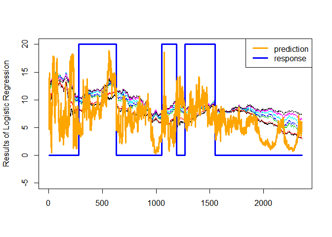<!-- -->

Calculate and plot log-odds and probabilities. Compare probabilities
with fitted values.

``` r
# Calculate odds
Log.Odds<-predict(LogisticModel_All)     # predict log-odds
Probabilities<-1/(exp(-Log.Odds)+1)      # predict probabilities
```

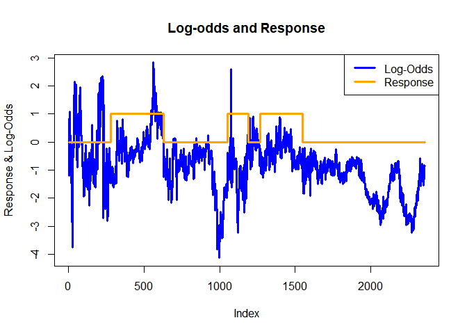<!-- -->

Use logistic regression to predict probabilities of tightening for new
input data.

``` r
# New Predictors
(newPredictors<-unname(unlist(AssignmentDataLogistic[1,1:7])))
```

    ## [1] 12.690 12.870 14.119 14.440 14.614 14.572 14.412

``` r
predict(LogisticModel_All,newdata=data3,type='response')
```

    ##         1 
    ## 0.2075972

``` r
summary(LogisticModel_All)
```

    ## 
    ## Call:
    ## glm(formula = Tightening ~ USGG3M + USGG6M + USGG2YR + USGG3YR + 
    ##     USGG5YR + USGG10YR + USGG30YR, family = binomial(link = logit), 
    ##     data = AssignmentDataLogistic)
    ## 
    ## Deviance Residuals: 
    ##     Min       1Q   Median       3Q      Max  
    ## -2.2113  -0.8595  -0.5935   1.1306   2.5530  
    ## 
    ## Coefficients:
    ##             Estimate Std. Error z value Pr(>|z|)    
    ## (Intercept)  -4.7552     0.4312 -11.029  < 2e-16 ***
    ## USGG3M       -3.3456     0.2666 -12.548  < 2e-16 ***
    ## USGG6M        4.1559     0.3748  11.089  < 2e-16 ***
    ## USGG2YR       3.9460     0.7554   5.224 1.75e-07 ***
    ## USGG3YR      -3.4642     0.9340  -3.709 0.000208 ***
    ## USGG5YR      -3.2115     0.7795  -4.120 3.79e-05 ***
    ## USGG10YR     -0.9705     0.9764  -0.994 0.320214    
    ## USGG30YR      3.3254     0.6138   5.418 6.04e-08 ***
    ## ---
    ## Signif. codes:  0 '***' 0.001 '**' 0.01 '*' 0.05 '.' 0.1 ' ' 1
    ## 
    ## (Dispersion parameter for binomial family taken to be 1)
    ## 
    ##     Null deviance: 2983.5  on 2357  degrees of freedom
    ## Residual deviance: 2629.6  on 2350  degrees of freedom
    ## AIC: 2645.6
    ## 
    ## Number of Fisher Scoring iterations: 4

## Comparing regression models

**Compare linear regression models with Output1 as response and
different combinations of predictors.**

Comparing Full model with null model

``` r
#complete model 
model_all = lm(Output1~USGG3M+USGG6M+USGG2YR+USGG3YR +USGG5YR +USGG10YR +USGG30YR,AssignmentDataRegressionComparison)
#null model
model_null = lm(Output1~1,AssignmentDataRegressionComparison)
```

Compare AIC Value

``` r
anova(model_all,model_null)
```

    ## Analysis of Variance Table
    ## 
    ## Model 1: Output1 ~ USGG3M + USGG6M + USGG2YR + USGG3YR + USGG5YR + USGG10YR + 
    ##     USGG30YR
    ## Model 2: Output1 ~ 1
    ##   Res.Df    RSS Df Sum of Sq        F    Pr(>F)    
    ## 1   8292      0                                    
    ## 2   8299 637400 -7   -637400 3.73e+22 < 2.2e-16 ***
    ## ---
    ## Signif. codes:  0 '***' 0.001 '**' 0.01 '*' 0.05 '.' 0.1 ' ' 1

``` r
c(Full=AIC(model_all),Null=AIC(model_null))
```

    ##       Full       Null 
    ## -313034.13   59589.86

Lets compare nested model using anove, small model (Predict output with
USGG3M) with big model (Predict output with USGG3M+ other rates)

``` r
#Given US Treasury rate = USGG3M
#Let the given rate be testRate. Let additionalRate be one of the remaining rates

mUSGG3M.2 = lm(Output1 ~ USGG3M , AssignmentData)
mUSGG6M.2 = lm(Output1 ~ USGG3M+USGG6M , AssignmentData)
mUSGG2YR.2 = lm(Output1 ~ USGG3M+USGG2YR , AssignmentData)
mUSGG3YR.2 = lm(Output1 ~ USGG3M+USGG3YR , AssignmentData)
mUSGG5YR.2 = lm(Output1 ~ USGG3M+USGG5YR , AssignmentData)
mUSGG10YR.2 = lm(Output1 ~ USGG3M+USGG10YR , AssignmentData)
mUSGG30YR.2 = lm(Output1 ~ USGG3M+USGG30YR , AssignmentData)

SumSq = c(anova(mUSGG3M.2,mUSGG6M.2)$'Sum of Sq'[2],
anova(mUSGG3M.2,mUSGG2YR.2)$'Sum of Sq'[2],
anova(mUSGG3M.2,mUSGG3YR.2)$'Sum of Sq'[2],
anova(mUSGG3M.2,mUSGG5YR.2)$'Sum of Sq'[2],
anova(mUSGG3M.2,mUSGG10YR.2)$'Sum of Sq'[2],
anova(mUSGG3M.2,mUSGG30YR.2)$'Sum of Sq'[2])

AIC = c(
AIC(mUSGG6M.2),
AIC(mUSGG2YR.2),
AIC(mUSGG3YR.2),
AIC(mUSGG5YR.2),
AIC(mUSGG10YR.2),
AIC(mUSGG30YR.2))
AIC
```

    ## [1] 27927.798 12178.727  5276.954 -6856.005  5106.432 12894.093

Compare SumSq and AIC explain by bigger model

``` r
SumSq
```

    ## [1]  9663.664 21601.990 22791.011 23495.322 22809.656 21412.436

``` r
AIC
```

    ## [1] 27927.798 12178.727  5276.954 -6856.005  5106.432 12894.093

## Rolling Window Analysis

Set window width and window shift parameters for rolling window.

``` r
Window.width<-20; Window.shift<-5
```

Find mean for rolling window.

``` r
# Means
all.means<-rollapply(AssignmentDataRegressionComparison,width=Window.width,
                     by=Window.shift,by.column=TRUE, mean)
head(all.means)
```

    ##       USGG3M  USGG6M USGG2YR USGG3YR USGG5YR USGG10YR USGG30YR  Output1
    ## [1,] 15.0405 14.0855 13.2795 12.9360 12.7825  12.5780  12.1515 20.14842
    ## [2,] 15.1865 14.1440 13.4855 13.1085 12.9310  12.7370  12.3370 20.55208
    ## [3,] 15.2480 14.2755 13.7395 13.3390 13.1500  12.9480  12.5500 21.04895
    ## [4,] 14.9345 14.0780 13.7750 13.4765 13.2385  13.0515  12.6610 21.02611
    ## [5,] 14.7545 14.0585 13.9625 13.6890 13.4600  13.2295  12.8335 21.31356
    ## [6,] 14.6025 14.0115 14.0380 13.7790 13.5705  13.3050  12.8890 21.39061

Plot the rolling means with the original 3-month rates data

``` r
Count<-1:dim(AssignmentDataRegressionComparison)[1]
Rolling.window.matrix<-rollapply(Count,width=Window.width,by=Window.shift,by.column=FALSE,FUN=function(z) z)
```

    ##  [1] 10 15 20 25 30 35 40 45 50 55

    ##       [,1]    [,2]
    ##  [1,]    1      NA
    ##  [2,]    2      NA
    ##  [3,]    3      NA
    ##  [4,]    4      NA
    ##  [5,]    5      NA
    ##  [6,]    6      NA
    ##  [7,]    7      NA
    ##  [8,]    8      NA
    ##  [9,]    9      NA
    ## [10,]   10 15.0405
    ## [11,]   11      NA
    ## [12,]   12      NA
    ## [13,]   13      NA
    ## [14,]   14      NA
    ## [15,]   15 15.1865
    ## [16,]   16      NA
    ## [17,]   17      NA
    ## [18,]   18      NA
    ## [19,]   19      NA
    ## [20,]   20 15.2480
    ## [21,]   21      NA
    ## [22,]   22      NA
    ## [23,]   23      NA
    ## [24,]   24      NA
    ## [25,]   25 14.9345

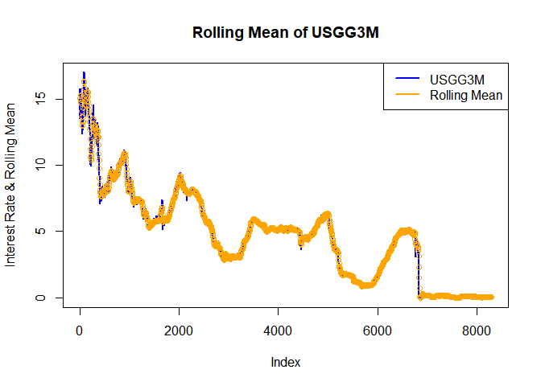<!-- -->

Use rolling apply to find Coefficients, R.squared, P-value, and predited
value for any specific date.

Look at pairwise X-Y plots of regression coefficients for the 3M, 5Yr
and 30Yr yields as inputs.

``` r
# Pairs plot of Coefficients
pairs(Coefficients)
```

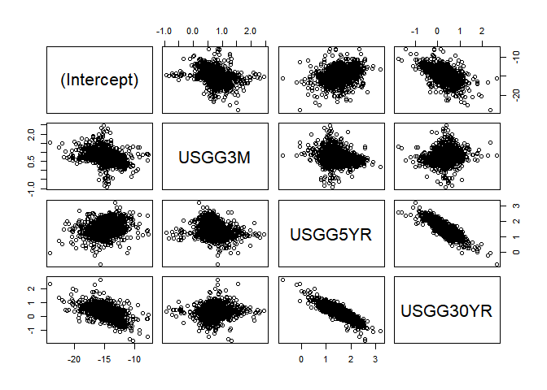<!-- -->

``` r
res
```

    ## $Date
    ## [1] "9/22/2005"
    ## 
    ## $Coefficients
    ##  (Intercept)       USGG3M      USGG5YR     USGG30YR 
    ## -14.12217691   0.42894717   2.01322980   0.02093892 
    ## 
    ## $P_values
    ##  (Intercept)       USGG3M      USGG5YR     USGG30YR 
    ## 3.647568e-20 3.080123e-06 1.548548e-16 8.175210e-01 
    ## 
    ## $R_squared
    ## [1] 0.9983905
    ## 
    ## $Prediction
    ## [1] -4.517689
    ## 
    ## $HighSensitivity
    ## [1] "USGG5YR"

# PCA

*Treasury yield has high correlated to each other that makes our model
risky for Multicollinearity. I will use PCA to decompose factors and
loadings to solve this problem and at the same time preserve
relationship from each Treasury yield and use in palce of predictors*

``` r
AssignmentDataPCA<-AssignmentData[,1:7]
dim(AssignmentDataPCA)
```

    ## [1] 8300    7

Explore the dimensionality of the set of 3M, 2Y and 5Y yields.

``` r
# Select 3 variables. Explore dimensionality and correlation 
AssignmentData.3M_2Y_5Y<-AssignmentDataPCA[,c(1,3,5)]
ggpairs(AssignmentData.3M_2Y_5Y)
```

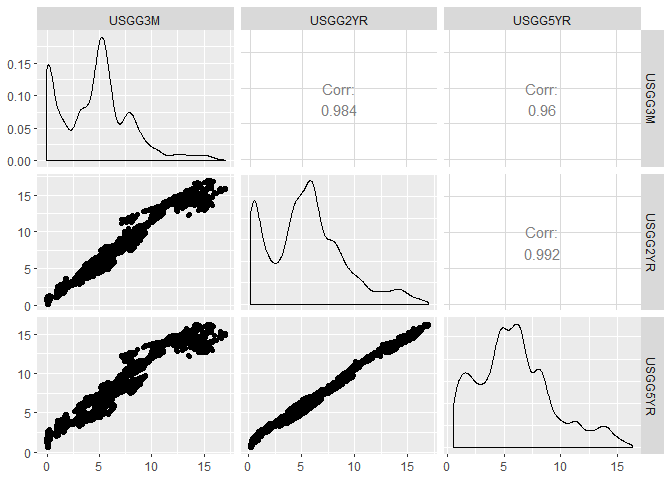<!-- -->

``` r
library(rgl);rgl.points(AssignmentData.3M_2Y_5Y)
```

Load data for date we want to see
change

``` r
data <- readRDS(paste(dataPath,'StatisticalAnalysis_Course_Assignment_5_Data.rds',sep = '/'))
data
```

    ## $testDate
    ## [1] "8/17/2012"
    ## 
    ## $testMaturity
    ## [1] "USGG6M"
    ## 
    ## $factorsChanges
    ##      Comp.1      Comp.2      Comp.3 
    ##  0.01994752 -0.10048877  0.01115206

``` r
Maturities<-c(.25,.5,2,3,5,10,30)
```

See importance of factors.

``` r
Eigen.Decomposition = princomp(AssignmentDataPCA)
Eigen.Decomposition
```

    ## Call:
    ## princomp(x = AssignmentDataPCA)
    ## 
    ## Standard deviations:
    ##     Comp.1     Comp.2     Comp.3     Comp.4     Comp.5     Comp.6 
    ## 8.76328616 1.24552572 0.34980817 0.11896932 0.09121611 0.04741989 
    ##     Comp.7 
    ## 0.03944169 
    ## 
    ##  7  variables and  8300 observations.

Find loadings and factors from principal component

``` r
#find loadings
Loadings = Eigen.Decomposition$loadings
#find factors 
Factors = Eigen.Decomposition$scores
```

Change sign and plot each factors
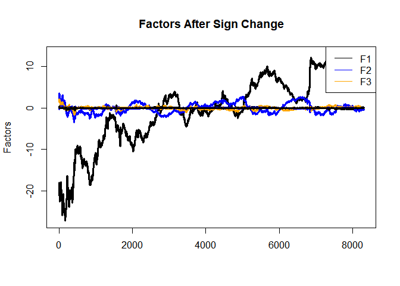<!-- -->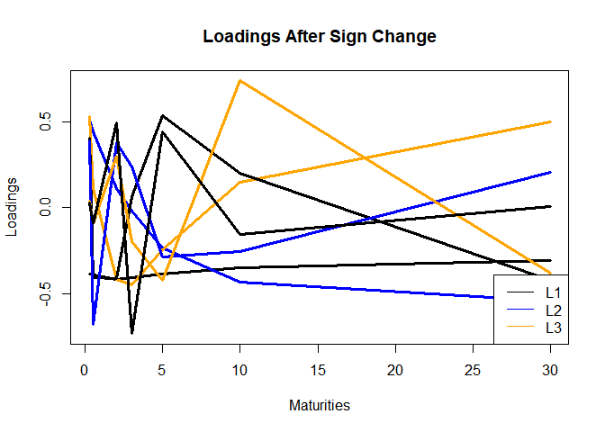<!-- -->

Analyze the adjustments that each factor makes to the term curve.

``` r
OldCurve<-AssignmentDataPCA[135,]
NewCurve<-AssignmentDataPCA[136,]
CurveChange<-NewCurve-OldCurve
FactorsChange<-Factors[136,]-Factors[135,]
ModelCurveAdjustment.1Factor<-OldCurve+t(Loadings[,1])*FactorsChange[1]
ModelCurveAdjustment.2Factors<-OldCurve+t(Loadings[,1])*FactorsChange[1]+t(Loadings[,2])*FactorsChange[2]
ModelCurveAdjustment.3Factors<-OldCurve+t(Loadings[,1])*FactorsChange[1]+t(Loadings[,2])*FactorsChange[2]+
  t(Loadings[,3])*FactorsChange[3]
matplot(Maturities,
        t(rbind(OldCurve,NewCurve,ModelCurveAdjustment.1Factor,ModelCurveAdjustment.2Factors,
                ModelCurveAdjustment.3Factors)),
        type="l",lty=c(1,1,2,2,2),col=c("black","red","green","blue","magenta"),lwd=3,ylab="Curve Adjustment")
legend(x="topright",c("Old Curve","New Curve","1-Factor Adj.","2-Factor Adj.",
                      "3-Factor Adj."),lty=c(1,1,2,2,2),lwd=3,col=c("black","red","green","blue","magenta"))
```

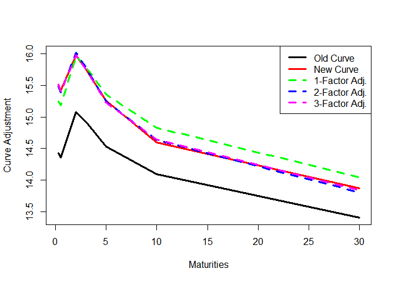<!-- -->
