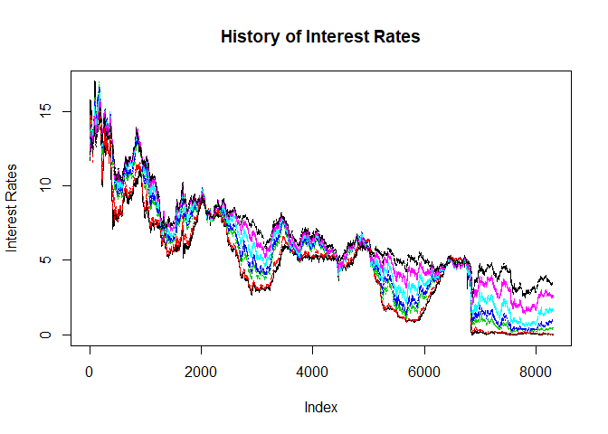
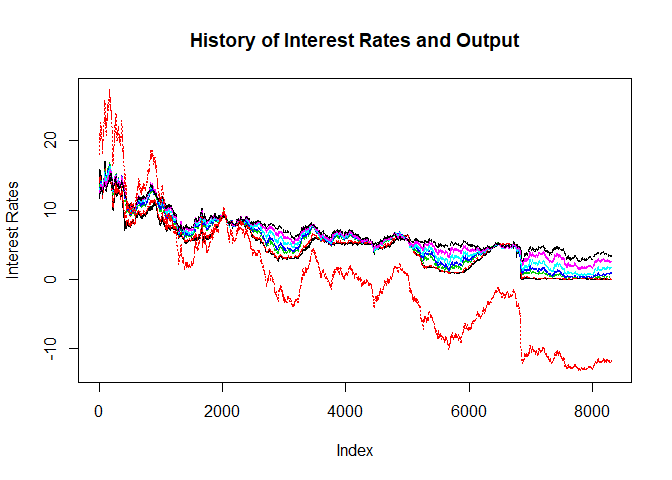

Predicting Financial behavior
================
PK (Kasidit) Ratanavijai
10/25/2019

# Project objectives

Predicting cycles when FED implemented easing policy (reducing rates) or
tightening policy (increasing rates) and Investor’s behavior towards
long term and short term financial assest by using “DAILY TREASURY YIELD
CURVE RATES” from year January 1981 to June 2014 total of 33 years.

The data set composed of date, rate of US Generic Government teasury 3
months yield, 6 months, 2 years, 3 years, 5 years, 10 years and 30
years, and whether FED was using easing policy (reducing rates) or
tightening policy (increasing rates) at the time.

It is public data set and can be found on *treasury.gov*
(<https://home.treasury.gov/policy-issues/financing-the-government/interest-rate-statistics>)

# Data exploration

**Data
    Summary**

    ##      USGG3M           USGG6M           USGG2YR           USGG3YR       
    ##  Min.   :-0.041   Min.   : 0.0051   Min.   : 0.1532   Min.   : 0.2764  
    ##  1st Qu.: 1.705   1st Qu.: 1.8060   1st Qu.: 2.7265   1st Qu.: 3.1298  
    ##  Median : 4.994   Median : 5.1049   Median : 5.4000   Median : 5.5215  
    ##  Mean   : 4.675   Mean   : 4.8444   Mean   : 5.4389   Mean   : 5.6445  
    ##  3rd Qu.: 6.275   3rd Qu.: 6.5160   3rd Qu.: 7.5495   3rd Qu.: 7.6939  
    ##  Max.   :17.010   Max.   :15.9300   Max.   :16.9590   Max.   :16.5900  
    ##                                                                        
    ##     USGG5YR           USGG10YR         USGG30YR         Output1        
    ##  Min.   : 0.5426   Min.   : 1.387   Min.   : 2.453   Min.   :-13.1731  
    ##  1st Qu.: 3.6628   1st Qu.: 4.262   1st Qu.: 4.822   1st Qu.: -6.5091  
    ##  Median : 5.7350   Median : 5.955   Median : 6.221   Median : -0.4149  
    ##  Mean   : 6.0094   Mean   : 6.481   Mean   : 6.869   Mean   :  0.0000  
    ##  3rd Qu.: 7.8975   3rd Qu.: 8.185   3rd Qu.: 8.310   3rd Qu.:  4.8599  
    ##  Max.   :16.2740   Max.   :15.842   Max.   :15.212   Max.   : 27.2979  
    ##                                                                        
    ##      Easing       Tightening  
    ##  Min.   :1      Min.   :1     
    ##  1st Qu.:1      1st Qu.:1     
    ##  Median :1      Median :1     
    ##  Mean   :1      Mean   :1     
    ##  3rd Qu.:1      3rd Qu.:1     
    ##  Max.   :1      Max.   :1     
    ##  NA's   :6715   NA's   :7527

**Structure of the data set**

  - **USGG3M** `<numeric>` rate of US Generic Government teasury 3
    months yield
  - **USGG6M** `<numeric>` rate of US Generic Government teasury 6
    months yield
  - **USGG2YR** `<numeric>` rate of US Generic Government teasury 2
    years yield
  - **USGG5YR** `<numeric>` rate of US Generic Government teasury 3
    years yield
  - **USGG10YR** `<numeric>` rate of US Generic Government teasury 5
    years yield
  - **USGG30YR** `<numeric>` rate of US Generic Government teasury 10
    years yield
  - **Output1** `<numeric>` sssssxxxx
  - **Easing** `<int>` whether FED was using easing policy (reducing
    rates)
  - **Tightening** `<int>` whether FED was using tightening policy at
    the time (increasing rates)

First 7 variables (input variables) are daily records of the US Treasury
yields to maturity. The last two variables mark periods when FED
implemented easing policy (reducing rates) or tightening policy
(increasing rates).

**Header of the training data
    set**

    ##           USGG3M USGG6M USGG2YR USGG3YR USGG5YR USGG10YR USGG30YR  Output1
    ## 1/5/1981   13.52  13.09  12.289   12.28  12.294   12.152   11.672 18.01553
    ## 1/6/1981   13.58  13.16  12.429   12.31  12.214   12.112   11.672 18.09140
    ## 1/7/1981   14.50  13.90  12.929   12.78  12.614   12.382   11.892 19.44731
    ## 1/8/1981   14.76  14.00  13.099   12.95  12.684   12.352   11.912 19.74851
    ## 1/9/1981   15.20  14.30  13.539   13.28  12.884   12.572   12.132 20.57204
    ## 1/12/1981  15.22  14.23  13.179   12.94  12.714   12.452   12.082 20.14218
    ##           Easing Tightening
    ## 1/5/1981      NA         NA
    ## 1/6/1981      NA         NA
    ## 1/7/1981      NA         NA
    ## 1/8/1981      NA         NA
    ## 1/9/1981      NA         NA
    ## 1/12/1981     NA         NA

**History of Interest Rates**

<!-- -->

**History of Interest Rates and Output**

<!-- -->
